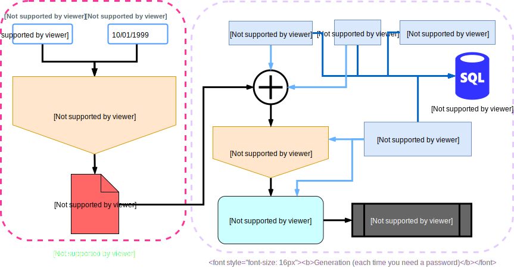

# derivatex

Smart pseudo-random password generator

**Keep your SECRET_DIGEST.TXT and DATABASE files safe !!!**

## Features overview

- Generates a **different** **strong** password for each website
- **Always** generates the same password for the same website
- Default password generation settings
  - **Match most website password requirements**
  - Produces a **very strong password** (entropy of 128 bits)
- Default password generation settings produce strong passwords with
  - 20 characters
  - An equal amount of symbols, digits, lowercase letters and uppercase letters
  - A pseudo-random order of characters
- Password generation settings **can be changed** for a particular website
  - In example: password length, no symbols, etc.
- Password generation settings and corresponding user are stored in a SQLite database in the file *database*
- The database can be dumped to a friendlier CSV file
- Restore your generator using your master password and your birthdate and 10 minutes
- Only carry 3 files to generate your passwords
- Argon2id is used to produce *secret_digest.txt* to remove the low entropy issue of your master password.

## Scheme overview



*A few notes*:

- Sign up and log in procedures both require the generation of a password
- Passwords are not saved and only rely on `secret_digest.txt`, you should not save the generated passwords
- The SQLite database is stored in the local file `database`
- The database is used to check for existing records and modify them if necessary

## Other security aspects

- Extensive unit testing for solid security
- Minimal memory footprint of sensitive data using pointers for byte arrays

## Resistance

Let's assume *Eve* is the attacker, and *www.terriblewebsite.com* is a website having bad security systems.

The following list of situations goes from most likely to happen to most unlikely to happen.

- **Situation**: *Eve* hacks the database of *www.terriblewebsite.com* which stores passwords in plaintext
  - **Damage**: *Eve* has access to your account at *www.terriblewebsite.com* only
  - **Resistance**: *Eve* can't access other websites you are registered at (*each password generated is unique*)
  - **Resistance**: The *secret_digest.txt* file can't be obtained from the password (*password is derived using the SHA3 256 sponge hash function* - even quantum cracking would fail)
  - **Intervention**: Generate another password for *www.terriblewebsite.com* using the option flag `-round=2` (or more) and change your password on *www.terriblewebsite.com*
- **Situation**: *Eve* knows your username and tries to bruteforce your account on *www.terriblewebsite.com*
  - **Resistance**: Using default settings (or similar or better), *Eve* will need centuries to bruteforce successfully the password in parallel using GPUs, FPGAs or ASICs
- **Situation**: *Eve* obtains your *secret_digest.txt*, *database* and *derivatex* files
  - **Resistance**: *Eve* can't recover your master password or birthdate (use of Argon2id with demanding resources)
  - **Intervention**: Change your master password completely, and change all your passwords ASAP
- **Situation**: *Eve* knows your birthdate **and** master password
  - **Damage**: *Eve* can re-generate your *secret_digest.txt* in about 10 minutes, and generate any password
  - **Resistance**: *Eve* does not know on which website you are registered and which password settings you used
  - **Intervention**: Change your master password completely, and change all your passwords ASAP

## Quick guide

### Download and installation

#### Download derivatex for your platform

(TODO)

#### Install using `go get`

1. Install [Golang](https://golang.org/dl/)
2. Download and compile the source code from the git repository

    ```bash
    go get -v github.com/qdm12/derivatex
    ```

3. The program `derivatex` is now built in `$GOPATH/bin`

#### Build from source

1. Install [dep](https://golang.github.io/dep/docs/installation.html) for dependency management.

2. Clone this project onto your `$GOPATH`:

    ```bash
    git clone https://github.com/qdm12/derivatex.git \
    $GOPATH/src/github.com/derivatex
    ```

3. Then build it:

    ```bash
    cd $GOPATH/src/github.com/derivatex
    dep ensure
    go build
    ```

### User interface

1. You might want to move the `derivatex` executable to a safe location, say `/your/safe/path/`
1. Go to `/your/safe/path/` and double-click on `derivatex` (TODO)

### Command line interface

1. You might want to move the `derivatex` executable to a safe location, say `/your/safe/path/`
1. With a terminal, go to `/your/safe/path/`

    ```bash
    cd /your/safe/path/
    ```

1. Create your master digest

    ```bash
    derivatex create
    ```

1. Generate your password for *Instagram* and your default user you have set

    ```bash
    derivatex generate instagram
    ```

Keep the **secret_digest.txt** file safe as it serves as the seed to the generation of your passwords.

The file *database* is only used to store information about the password generation and is not very sensitive, although it is better to keep it safe.

See more details on how to use it with:

```bash
derivatex help
```

## TODO

1. Fix working on a different drive
1. UI for desktop
1. Unit testing to finish
1. Yubikeys / Google Authnticator
1. Generate private keys i.e. RSA
1. Generate seed words (i.e. 12 words for cardano)
1. Calculate entropy of final password
1. Preferences file
    - Default search Exlusive or not
    - Smaller QR code
    - CSV separator

## Details

### Creation of secret_digest.txt

- Uses Argon2ID with the following parameters:
  - Data is the digest of SHA3_256(password)
  - Salt is the SHA3_256(birthdate)
  - Time cost is 500 rounds (takes 4 minutes on the quad core machine)
  - Memory required is 2048MB
  - Parallelism is set to 1 thread
- Resistant to parallel attacks (2048MB Memory per processing unit)
- Most of computers / phones have 2048MB of ram
- Outputs a 512bits key

### Pseudo-random password generation

- Fast, deterministic and resistant to bruteforce attacks
- Pseudo randomn permutations by using rand.Seed with different source data
- Final password is obtained by:
  - SHA3_256(secretDigest+name)
  - Forcing the first 4 bytes (or less) to be in a pseudo-random order:
    - ASCII lowercase letter
    - ASCII uppercase letter
    - ASCII digit
    - ASCII symbol
  - Forcing the remaining bytes to be in another pseudo-random order one of the 4 ASCII categories shown above

### Password manager

- Each password generation creates a record in a SQLite database containing:
  - Website name
  - User (email, phone number, username), *defaults to the default user set*
  - Password length, *defaults to 20*
  - Round of hash function to generate the password, *defaults to 1*
  - Unallowed characters in the password, *defaults to none*
  - Creation date (automated)
  - Program version (automated) - in case the password generation changes, for backward compatibility
  - Note - an optional text note you can add
- The database can be searched
- The database content can be listed entirely or partially
- Records can be deleted from the database
- A table from the database can be dumped to a CSV file

## For the security paranoids

- Compile the code with different parameters
- Compile with Docker, run with Docker
- Do not disclose what program you are using
- Scan the QR code from an offline device

## Inspiration

- Seeds of Bitcoin wallets
- 12 words seed of Cardano wallets
- Hash functions
- Dashlane password manager
- Trusting no one / paranoia?
